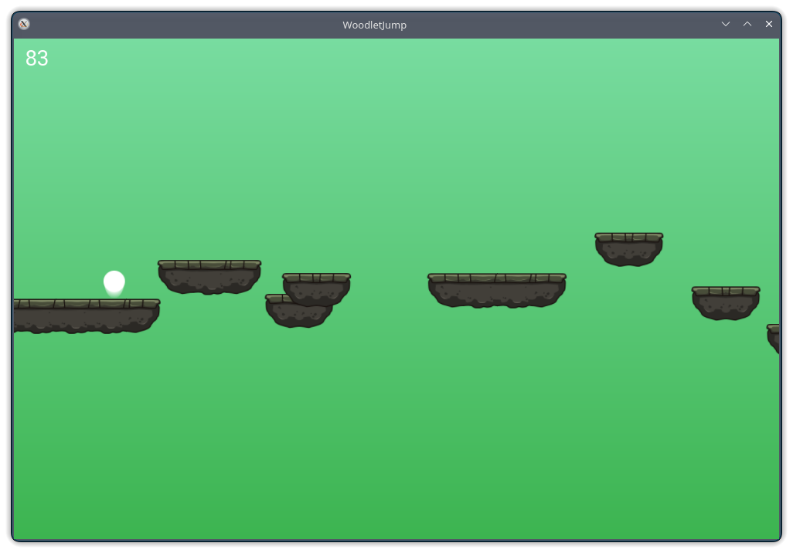

# Woodlet Jump
A platformer game written in C++.

The player jumps over procedurally generated platforms.
The goal is to achieve the greatest score (upper left corner), while not falling off any platform. The controls (keybinds) can be seen in the pause menu after pressing the Escape key

**Requirements**:
* Support for OpenGL 2.1
* SFML 3 (for window creation and text rendering) - installed with a package manager.
* CMake 3.6+
* C++ compiler with C++20 support



### Building (Linux)
```
cmake -DCMAKE_BUILD_TYPE=Release -B build -S .
cd build
make -j16
```
Then run the game (the program binary will be located in _bin_ folder):
```
cd ../bin/
./WoodletJump
```
### Known issues
* Keyboard controls on MacOS require special app permitions to be granted in system settings
### Assets
The assets used in the app are from [CRAFTPIX](https://craftpix.net/file-licenses/) free tilesets.